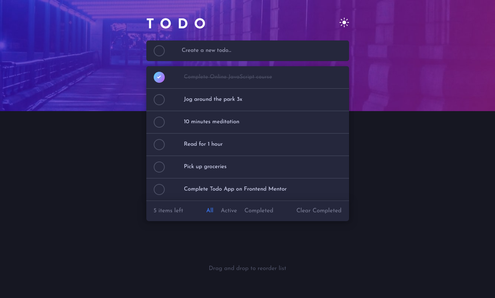

# Frontend Mentor - Todo app solution

Esta é uma solução para o [desafio do aplicativo Todo no Frontend Mentor](https://www.frontendmentor.io/challenges/todo-app-Su1_KokOW). Os desafios do Frontend Mentor ajudam você a melhorar suas habilidades de programação construindo projetos realistas.

## Visão Geral

### O desafio

Os usuários devem ser capazes de:

- Ver o layout ideal para o aplicativo dependendo do tamanho da tela de seu dispositivo;
- Ver estados de hover para todos os elementos interativos na página;
- Adicionar novas tarefas à lista;
- Marcar tarefas como completas;
- Excluir tarefas da lista;
- Filtrar por todas/ativas/completas;
- Limpar todas as tarefas concluídas;
- Alternar entre o modo claro e escuro;
- Bônus: Arrastar e soltar para reordenar itens na lista.

### Captura de tela

### Links

- URL da solução: https://www.frontendmentor.io/solutions/responsive-landing-page-using-sass-and-localstorage-qXdDydAeo6
- URL do site ao vivo: https://viniciuscorbim.github.io/todo-app/

### Construído com

- Marcação HTML5 semântica;
- Propriedades CSS personalizadas;
- Flexbox;
- Fluxo de trabalho mobile-first;
- Sass - pré-processador de CSS;
- JavaScript - para interações dinâmicas;
- localStorage - para armazenamento de dados.

### O que eu aprendi

- Melhorar o uso de HTML semântico;
- Melhorar o uso de CSS para certos tipos de estilização mais complexas;
- Melhorar meu desempenho com a linguagem de programação JavaScript;
- Ao realizar esse desafio proposto pelo Frentend Mentor eu pude ter uma melhor compreensão de como utilizar Sass, um pré-processador de CSS, em um projeto real.

## Autor

- Frontend Mentor - [@ViniciusCorbim](https://www.frontendmentor.io/profile/ViniciusCorbim)
